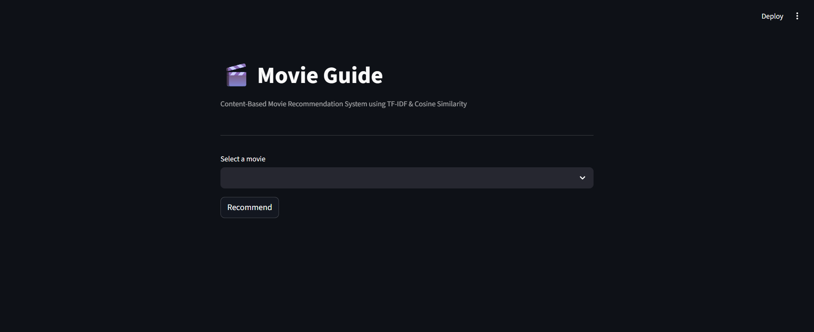
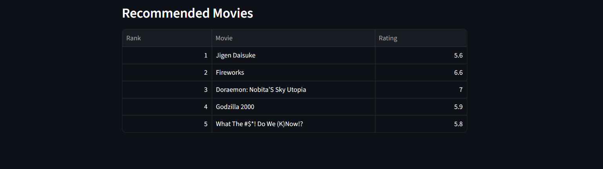
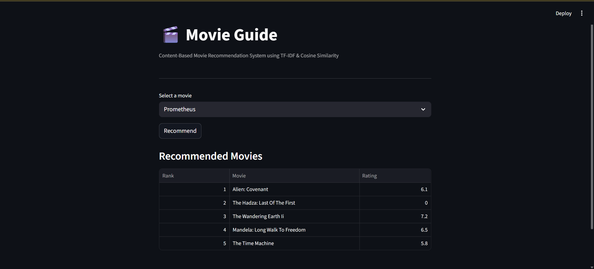

# Movie Guide — Movie Recommendation System

**Movie Guide** is a content-based movie recommendation system built using **TF-IDF vectorization** and **cosine similarity**.  
The system recommends movies similar to a given title by analyzing textual features such as **genres, keywords, cast, and movie overview**.

This project demonstrates an **end-to-end machine learning workflow**, including data preprocessing, feature engineering, model building, API integration, and an interactive web interface.

---

# Features

- Content-based movie recommendation system
- Text feature engineering using movie metadata
- TF-IDF vectorization of movie features
- Cosine similarity based recommendation engine
- Flask API for recommendation requests
- Interactive Streamlit web interface
- Fast recommendations using precomputed similarity matrix
- Displays movie ratings in recommendation results
- Modular and clean project architecture

---

# How the Recommendation System Works

The recommendation engine follows this pipeline:


Movie Metadata
↓
Text Preprocessing
↓
Feature Engineering (combined_features)
↓
TF-IDF Vectorization
↓
Cosine Similarity Matrix
↓
Recommendation Engine
↓
Flask API
↓
Streamlit Web Interface


## Recommendation Flow

When a user selects a movie:

1. The selected movie is matched in the dataset.
2. The system retrieves similarity scores from the cosine similarity matrix.
3. Movies are ranked based on similarity scores.
4. The top N similar movies are returned.
5. The results are displayed in the Streamlit interface with ratings.

---

# Dataset

The project uses a movie metadata dataset containing **approximately 5800 movies**.

### Key attributes include:

- Movie Title
- Genres
- Keywords
- Cast
- Overview
- Vote Average
- Popularity

After preprocessing, the dataset contains approximately:


5798 movies
36 processed features


---

# Technologies Used

- **Python**
- **Pandas**
- **NumPy**
- **Scikit-learn**
- **TF-IDF Vectorizer**
- **Cosine Similarity**
- **Flask** (API layer)
- **Streamlit** (web interface)

---

# Project Architecture

The project follows a **modular machine learning architecture**:


User Interface (Streamlit)
↓
Flask API
↓
Recommendation Engine
↓
TF-IDF + Cosine Similarity Model
↓
Preprocessed Movie Metadata


This structure separates **model logic, API handling, and UI**, making the system easier to maintain and extend.

---

# Project Structure


movie_guide/
│
├── assets/
│ ├── app_home.png
│ ├── recommendation_results.png
│ └── recommendation_example.png
│
├── data/
│ └── processed/
│ ├── movies_final.csv
│ ├── credits_clean.csv
│ └── ratings_summary
│
├── models/
│ ├── tfidf_vectorizer.pkl
│ ├── similarity_matrix.pkl
│ └── movies_metadata.pkl
│
├── notebooks/
│ ├── 01_explore_data.ipynb
│ ├── 02_cleaning_exploration.ipynb
│ ├── 03_clean_movie_dataset.ipynb
│ ├── 04_clean_credits_dataset.ipynb
│ ├── 05_process_ratings.ipynb
│ ├── 06_final_dataset.ipynb
│ └── 07_tfidf_vectorization.ipynb
│
├── api/
│ └── app.py
│
├── src/
│ ├── init.py
│ └── recommender.py
│
├── streamlit_app.py
├── requirements.txt
├── README.md
└── .gitignore


---

# Installation

## Clone the repository

```bash
git clone https://github.com/Mohd-Faizan-Khan/Movie_Guide.git
cd Movie_Guide
```

## Create a virtual environment

```bash
python -m venv venv
```

## Activate the environment

### Windows

```bash
venv\Scripts\activate
```

## Install dependencies

```bash
pip install -r requirements.txt
```

---

# Running the Application

## Start the Flask API

```bash
python api/app.py
```

## Start the Streamlit UI

```bash
streamlit run streamlit_app.py
```

## Open the browser

```
http://localhost:8501
```

---

# Application Preview

## Movie Selection Interface



---

## Recommendation Results



---

## Example Recommendation



---

# Future Improvements

Potential enhancements for this project:

- Add movie posters using **TMDB API**
- Implement **collaborative filtering**
- Build a **hybrid recommendation system**
- Add **genre filters**
- Improve search with **fuzzy matching**
- Deploy the system as a **cloud application**

---

# Key Learnings

Through this project I gained hands-on experience with:

- Building **content-based recommendation systems**
- Text feature engineering for **machine learning**
- **TF-IDF vectorization**
- **Cosine similarity modeling**
- **Modular machine learning project design**
- Building APIs using **Flask**
- Developing ML interfaces using **Streamlit**

---

# Author

**Mohd Faizan Khan**

B.Tech — Information Technology  
Aspiring **AI Engineer | Python Developer**

GitHub  
https://github.com/Mohd-Faizan-Khan