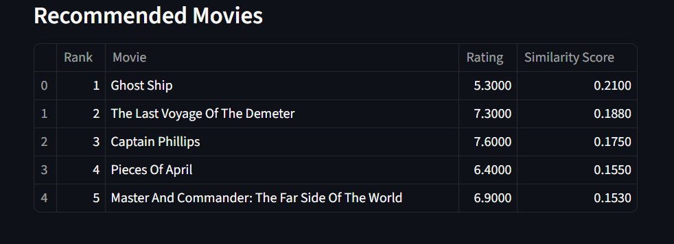

 
# Movie Guide — Movie Recommendation System
Built as a beginner Machine Learning project demonstrating content-based recommendation systems using TF-IDF and cosine similarity.

A **content-based movie recommendation system** built using **TF-IDF vectorization** and **cosine similarity**.  
The system recommends movies similar to a given title by analyzing textual features such as genres, keywords, cast, and movie overview.

This project demonstrates an end-to-end machine learning workflow, including data preprocessing, feature engineering, similarity modeling, and deployment using an interactive web application.

---

# Features

- Content-based movie recommendation system
- TF-IDF based text feature vectorization
- Cosine similarity for movie matching
- Interactive web application built with Streamlit
- Clean modular project architecture
- Fast recommendations using saved ML artifacts
- Handles flexible movie title input

---

# How the Recommendation System Works

The system follows this pipeline:

```
Movie Metadata
        ↓
Text Preprocessing
        ↓
Feature Engineering (combined_features)
        ↓
TF-IDF Vectorization
        ↓
Cosine Similarity Matrix
        ↓
Recommendation Function
        ↓
Streamlit Web Interface
```

When a user enters a movie title:

1. The system finds the movie in the dataset.
2. It retrieves similarity scores from the cosine similarity matrix.
3. Movies are ranked based on similarity.
4. The top recommended movies are returned.

---

# Dataset

The project uses a movie metadata dataset containing **~5800 movies** with attributes such as:

- Movie Title
- Genres
- Keywords
- Cast
- Overview
- Vote Average
- Popularity

After preprocessing, the final dataset contains:

```
5798 movies
36 features
```

---

# Technologies Used

- Python
- Pandas
- Scikit-learn
- TF-IDF Vectorizer
- Cosine Similarity
- Streamlit

---

# Project Structure

```
movie_guide/
│
├── assets/
│   ├── app_home.png
│   ├── recommendation_results.png
│   └── recommendation_example.png
│
├── data/
│   └── processed/
│       ├── movies_final.csv
│       ├── credits_clean.csv
│       └── ratings_summary
│
├── models/
│   ├── tfidf_vectorizer.pkl
│   ├── similarity_matrix.pkl
│   └── movies_metadata.pkl
│
├── notebooks/
│   ├── 01_explore_data.ipynb
│   ├── 02_cleaning_exploration.ipynb
│   ├── 03_clean_movie_dataset.ipynb
│   ├── 04_clean_credits_dataset.ipynb
│   ├── 05_process_ratings.ipynb
│   ├── 06_final_dataset.ipynb
│   └── 07_tfidf_vectorization.ipynb
│
├── src/
│   ├── __init__.py
│   ├── recommender.py
│   └── app.py
│
├── requirements.txt
├── README.md
└── .gitignore
```

# Installation

Clone the repository:

```bash
git clone https://github.com/yourusername/movie-guide.git
cd movie-guide
```

Create a virtual environment:

```bash
python -m venv venv
```

Activate the environment

Windows:

```bash
venv\Scripts\activate
```

Install dependencies:

```bash
pip install -r requirements.txt
```

---

# Running the Application

Run the Streamlit application:

```bash
streamlit run src/app.py
```

The application will open automatically in your browser.

---

# Example

User input:

```
Inception
```

Recommended movies:

```
1. Don Jon
2. The Revenant
3. (500) Days of Summer
4. Hesher
5. Tenet
```

Recommendations are based on **text similarity between movie metadata features**.

---

# Application Preview

- Movie search interface

- Recommendation results table

- Recommendation example

---

# Future Improvements

Possible enhancements for the project:

- Add movie posters using TMDB API
- Genre-based filtering
- Hybrid recommendation system
- Collaborative filtering
- Deploy the application online

---

# Key Learnings

Through this project I learned:

- Building a **content-based recommender system**
- Text feature engineering
- TF-IDF vectorization
- Cosine similarity modeling
- Modular machine learning project architecture
- Developing interactive ML applications using Streamlit

---

# Author

**Mohd Faizan Khan**

B.Tech — Information Technology  
Aspiring AI Engineer | Python Developer